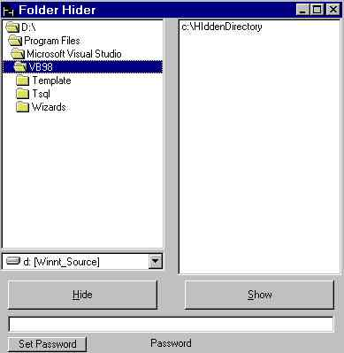



## File Hider: Hide a folder or hide files from windows and dos\!

### Description

This code shows how to hide and unhide folders from the operating system. Shows how to manipulate file and folder attribute bytes to hide folders and/or hide files. Hidden folders and all their contents will be invisible to any and all applications until you unhide it. This program requires you to create a text file called pltQr01w.sys which will hold your initial password before you use it. Not doing so will no longer cause a run-time error, but rather will ask you what you would like the password to be. Bug reports to skatulka@bigfoot.com
 
### More Info
 

             |
---                |---
**Submitted On**   |2000-10-18 08:51:14
**By**             |[Stephen Katulka](https://github.com/Planet-Source-Code/PSCIndex/blob/master/ByAuthor/stephen-katulka.md)
**Level**          |Intermediate
**User Rating**    |2.9 (23 globes from 8 users)
**Compatibility**  |VB 6\.0
**Category**       |[Complete Applications](https://github.com/Planet-Source-Code/PSCIndex/blob/master/ByCategory/complete-applications__1-27.md)
**World**          |[Visual Basic](https://github.com/Planet-Source-Code/PSCIndex/blob/master/ByWorld/visual-basic.md)
**Archive File**   |[CODE\_UPLOAD1074510182000\.zip](https://github.com/Planet-Source-Code/stephen-katulka-file-hider-hide-a-folder-or-hide-files-from-windows-and-dos__1-12106/archive/master.zip)

